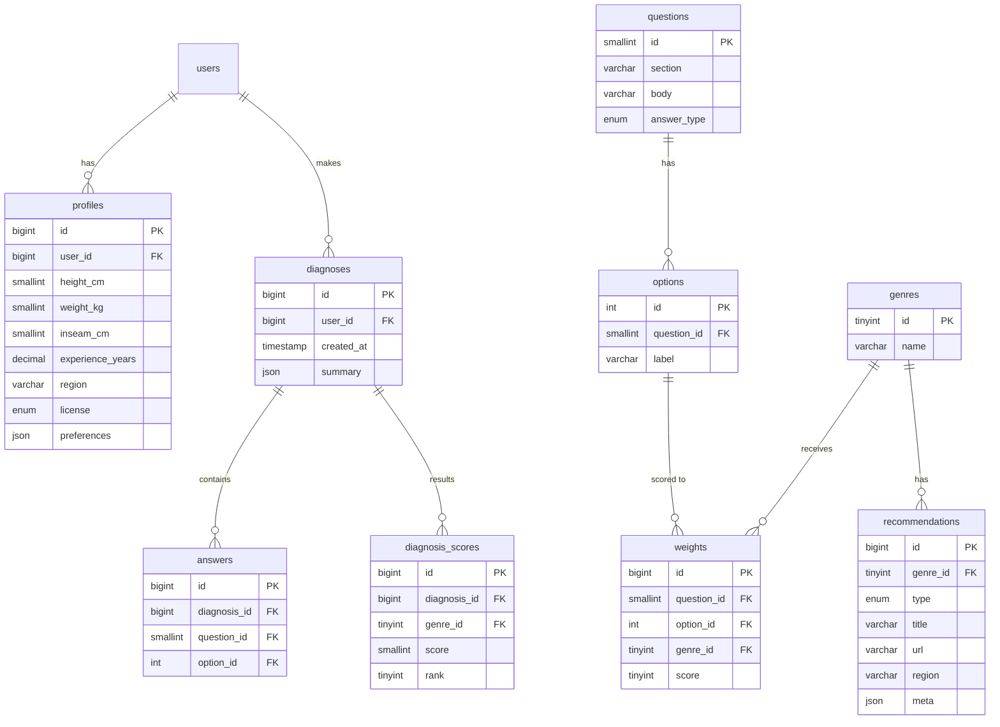

```mermaid
erDiagram
    users ||--o{ profiles : has
    users ||--o{ diagnoses : "makes"

    profiles {
        bigint id PK
        bigint user_id FK
        smallint height_cm
        smallint weight_kg
        smallint inseam_cm
        decimal experience_years
        varchar region
        enum license
        json preferences
    }

    genres {
        tinyint id PK
        varchar name
    }

    questions {
        smallint id PK
        varchar section
        varchar body
        enum answer_type
    }

    options {
        int id PK
        smallint question_id FK
        varchar label
    }

    weights {
        bigint id PK
        smallint question_id FK
        int option_id FK
        tinyint genre_id FK
        tinyint score
    }

    diagnoses {
        bigint id PK
        bigint user_id FK
        timestamp created_at
        json summary
    }

    answers {
        bigint id PK
        bigint diagnosis_id FK
        smallint question_id FK
        int option_id FK
    }

    diagnosis_scores {
        bigint id PK
        bigint diagnosis_id FK
        tinyint genre_id FK
        smallint score
        tinyint rank
    }

    recommendations {
        bigint id PK
        tinyint genre_id FK
        enum type
        varchar title
        varchar url
        varchar region
        json meta
    }

    questions ||--o{ options : "has"
    options ||--o{ weights : "scored to"
    genres ||--o{ weights : "receives"
    diagnoses ||--o{ answers : "contains"
    diagnoses ||--o{ diagnosis_scores : "results"
    genres ||--o{ recommendations : "has"
```
